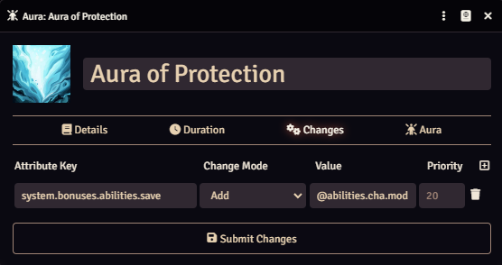
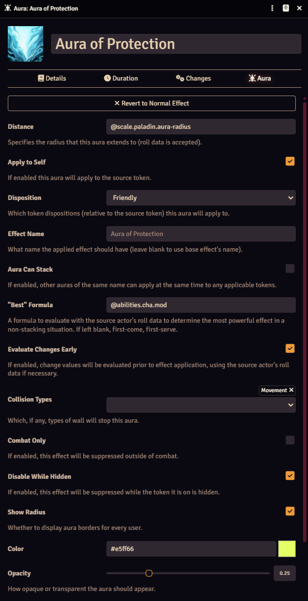

# Aura Effects
## Summary
A module that lets Active Effects to be configured as "Auras," automatically applying to tokens within a configured range, and optionally showing a visualization of the aura.

## Example: Aura of Protection
In the 5e system, "Aura of Protection" is an aura that paladins get which provides a bonus to saving throws for allies within 10 (later 30) feet equal to the charisma modifier of the paladin. If within range of two paladins both emanating the aura, a character only receives the better of the two. Here is how that could be set up using Aura Effects:

1. Create an Active Effect, and convert it to an Aura.

2. Set the Changes as such (in theory, `max(1, @abilities.cha.mod)`, but that doesn't fit in a picture).

3. Configure:
- Set distance (10 feet)
- Ensure the aura applies to the source
- Set disposition to only affect friendly tokens
- Ensure it _cannot_ stack
- Define the formula to be used for determining "best" aura to the bonus that will be granted
- Set the changes to evaluate _prior_ to application (this ensures that the _paladin_'s charisma mod will be granted, not each target's own charisma mod)
- The rest is up to your discretion as a user/GM

## Details
### Distance Calculation
Distance is calculated differently depending on whether the scene is gridless or gridded. If gridless, it is center-to-center, minus the external radius (generally, half width) of the "source" token. If gridded, it uses whichever diagonal measurement rules have been set in core settings and calculates the closest distance between two tokens based on which grid spaces they occupy (this means that a 2x2 token on a square grid, for instance, will compute the distance from the center of each of its 4 occupied squares to another token's occupied spaces, and use the smallest value when determining whether the aura should apply).

### Disposition
Disposition is largely as-expected: Hostile applies only to tokens whose disposition is opposite that of the source token (note: will still apply to self unless that setting is unchecked). Friendly applies only to tokens whose disposition matches that of the source token. "Any" applies to tokens regardless of disposition. Worth noting, a "Neutral" disposition token will _never_ be considered Friendly or Hostile, nor will a "Secret" disposition token. Both will still be considered valid recipients of an "Any"-disposition aura.

### Evaluate Changes Early
If checked, any Roll Data being used in an effect change will be evaluated based on the Roll Data of the parent of the effect, instead of being left un-evaluated. For example, if your system has `@strength` accessible via Roll Data, and you want the aura to grant a bonus equal to the _aura source_'s `@strength` value, you would check the box. If instead, you wanted the aura to grant bonuses equal to each _recipient_'s `@strength` value, you would leave the box unchecked. I will endeavor not to show this toggle for any systems (or modules) which make it irrelevant.

### Collision Types
Set "Collision Types" refer to the types of wall which will block an aura. By default, auras are blocked by walls which block movement (as reflected by the default value for that field).

### Aura Visualization
When visualizing the auras on a gridded scene, tokens larger than 1x1 may have _visual_ bounds that don't line up exactly with the actual computed distances. This is more likely to happen on larger-radius auras, and is a consequence of avoiding excessive calculations each time a token is refreshed.

### Conditional Script
The "Conditional Script" field expects an expression - if truthy (or left blank) the aura will apply to any tokens according to the other configuration fields. If falsy, the aura will _not_ apply to the token for whom it is being evaluated, regardless of other circumstances. Currently, variables available for use are:
- `token`: The Token placeable who _might_ receive the effect, depending on the evaluation result.
- `actor`: The Actor for said Token.
- `sourceToken`: The Token placeable from whom the aura is emanating.
- `rollData`: The roll data for the above actor

### Aura Can Stack & "Best" Formula
"Aura Can Stack" is fairly straightforward; if true, multiple auras of the same name can apply to the same token. Otherwise, only one can apply at a time. What determines _which_ of multiple applies is whatever is entered in the `"Best" Formula` field. It can be any valid deterministic formula, which will be evaluated on the _source_ actor's roll data. For instance, as in the example above, you could set it to `@abilities.cha.mod` in the 5e system, and then the "strongest" aura would belong to the source with the best Charisma modifier.
